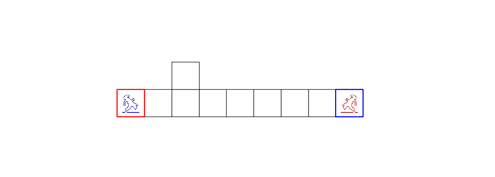
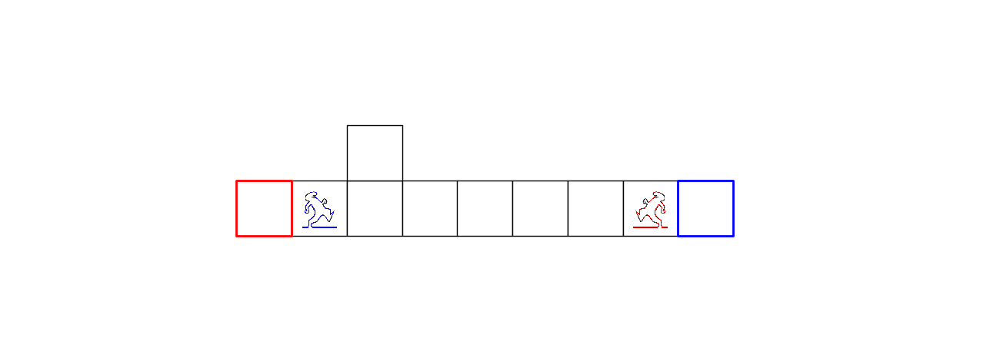
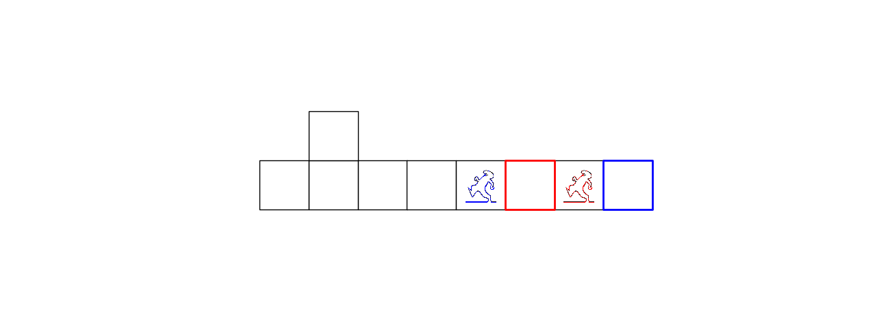

# narrow-corridor-ai
A multi-agent reinforcement learning project for crowd-dynamics in a very narrow corridor

## problem 
Two agents are standing at the two ends of a very narrow corridor. These agents like to swap their places, i.e. the blue agent likes to go to the blue square, and the red agent likes to the red square.

The difficulty is that the corridor so narrow that these agents cannot pass by each other. Luckily, at one section of the corridor its width become slightly larger such that one agent can pass if the other goes into that opening. 
This tiny opening is **the only way** that they can get to their desired locations. Here, we compare different simulation methods which can be used to simulate how the agents get to their desired places.

## different simulation approaches
Here, we compared these three different lattice-based approaches:
* an **entity-based** crowd dynamics model with a simple social force (which prevents the agents to overlap!!)

As one can see, it is very unlikely that without the psychological force and/or intelligence for the collaboration, the agents would be able to get to their desired positions.
* an rule-based **agent-based** crowd dynamics model with the above social force and a psychological force (which drives the agents to their desired positions)

The dynamics here is very interesting as each agent tends to go to its desired place irrespective of the presence of the other. Nevertheless, the social force repels them and they go back. They try this collision and repulsion process again and again, till randomly they get to explore the possibility of the opening and pass by each other.
Clearly this process requires many collision between the agents (which is not ideal for Mr. La Linea!). In this representative simulation, the agents collided with each other 8 times which is almost one collision for each step along the corridor!
* a ** multi-agent reinforcement learning** approach (in which overlaps are prohibited and the desired state is rewarded).

Using the multi-agent reinforcement learning, the agents find an optimal policy with which they get to their desired places without any collision. 
Although, for this problem the rule-based agent-based method also led to the desired state, one should mention that for a longer channel the probability of its success decreases. For some other problems which require collective/collaborative motion of the agents, the success of this method can be virtually impossible. An example of such problems is mentioned here, with its RL solution.

## future steps
* Here for the reinforcement learning, the model of the world is deterministic. It would be more realistic if one includes a probabilistic model.
* More agents in a geometry which forces higher degree of collaboration between them, e.g. transfer of passenger from the platform to the train and vice-versa which requires an optimal policy as train-doors allow only one agent to pass. Of course a realistic model can be obtained the considering the probabilistic nature of agents, as of course not everyone is behaving based on the optimal policy.

### important files:
* `simulation-narrow-corridor-random-motion.py` : simulation script for random motion of agents in the corridor
* `simulation-narrow-corridor-directed-motion-with-noise.py` : simulation script for directed motion (with tunable additional randomness)
* `narrow-corridor.py` : the RL code to find an optimal policy
* `simulation-narrow-corridor.py` : simulation code which executes the optimal policy obtained by `narrow-corridor.py`
